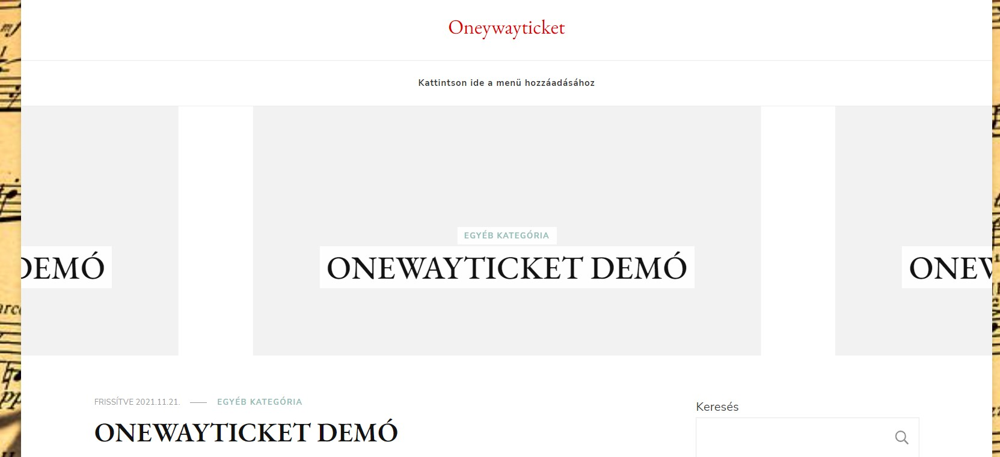
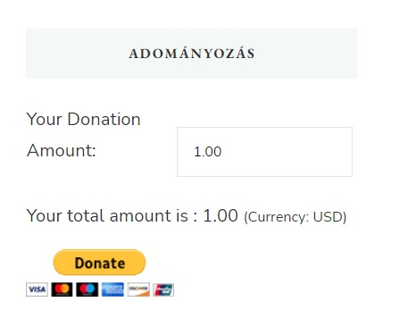

# Funkciónális specifikáció

## 1. Bevezetés

Alapvetően a zene a társadalom egy széles körét érinti és érdekli. Viszont nem sok ember szeretne rá sok pénzt áldozni mivel nincs abban a társadalmi helyzetben, hogy megengedhetné magának, vagy csak egyszerűen nem szándékozik rá tekinteni többként, mint élvezet. Ezért gondoltuk - én és munkatársaim -, hogy nem lenne rossz ötlet elkészíteni egy olyan internetes oldalt, ahol az egyén vagy család képes betekintést nyerni a megrendelő által nyújtott zenei ízlésbe. A felhasználáshoz tartozni fog egy AFSZ-et is, ami lefed minden jogi tájékoztatást a felhasználás kapcsán.

## 2. Jelenlegi helyzet

A megrendelő egy egyszerű és könnyen kezelhető alkalmazást szeretne, ahol a zenei stílus kedvelői képesek élvezni azokat anélkül, hogy az idejüknél többet kellene rá költeni. Az említett szoftvert a megrendelő webes felületen szeretné használni, regisztrációval és azután belépéssel. Az ügyfél ragaszkodott egy egyszerű és könnyen megérthető de mindent átfogó szabályzati oldalhoz. Jelenleg a program létrehozásához, elkészítéséhez szükséges adatokat, tevékenységeket várjuk a megrendelőtől.

## 3. Vágyálom rendszer

Szeretnénk nyújtani egy egyszerűen használható weboldalt, ahol megkönnyítenénk a zenei művész és az emberek közötti kapcsolatát, illetve hogy minél több emberhez eljusson a művész alkotásai. Terveink része a zenelejátszó átdolgozása. Többek között termünk új stílust adni neki, emelni a minőségén, növelni a hatékony működését és állíthatóvá tenni a letájtszó minőségét, hogy bármilyen internet kapcsolat mellett élvezhessük kedvenceinket. Továbbá, szeretnénk egy újabb, letisztultabb stílust adni a weboldalnak, hogy minél intuitívabb legyen. Ezt smnooth animációkkal tovább fokozva egy igazán gördülékeny weboldalt alkotnánk, ahol a felhasználó sosem érezné magát elveszve, megkönnyítve az általános felhasználást és a navigálást a különboző oldalak között.

## 4. Feltételek

Az alkalmazásunk létrehozásának alapfeltétele, a PHP, vagy valamilyen más webprogramozási nyelv. SQL adatbázist használtnánk, ahol elmentjük a regisztráló adatait. HTML-ben írjnánk tovább az oldal leíró részét, és ezzel szabványosítjuk azt. CSS-el felújítanánk az oldalunk külsőjét, amivel igényesen, dizájnosan és modernek fog kinézni.

## 5. Jelenlegi üzleti folyamatok modellje

A mai világban a legtöbb ember rádión kívül nem igazán hallgat mást. Ennek főbb oka a zeneszolgáltatások ára lehet, így nem ritka a feketén beszerzett zeneszámok (Sajnos olyanok is fordulnak ilyen módszerekhez, akik ezzel foglalkoznak (lást DJ-k)). Ezért arra jutottunk, én és a munkatársaim, hogy egy ingyenes, könnyű regisztrációs oldalt hozzunk létre, amely felkelti azon emberek érdeklődését akiket mindig érdekelt a zenei stílus viszont nem szerettek volna rájuk költeni.

## 6. Igényelt üzleti folyamatok modellje

Az általunk elkészített weboldalon egy olyan modernkori problémával igyekeztünk szembe nézni, amely bizonyos tartalomgyártóknak, művészeknek ebben a hirtelen fejlődő világban gyakorta kell szembenézniük. Sajnos ez a probléma nem mindenki számára könnyen abszolválható, de mi igyekeztünk erre törekedve a lehető legjobb megoldást találni a problémára. A weboldalon található tartalmakat kedvükre fogyaszthatják, de csak korlátozott mennyiségben. Azonban egy könnyed, gyors és ingyenes regisztráció után a tartalmakat támogatói díj ellenében szabadon használhatják, mindenféle korlátozások nélkül, amelyeket akár le is tölthetnek.

## 7. Használati esetek

A felhasználó az alábbi tevékenységeket végezheti általánosan:

-   Böngészheti a weboldalt
-   Megtekintheti a weboldalon lévő
-   Regisztrálhat és törölheti a fiókját

A felhasználó az alábbi tevékenységeket is végezheti regisztráció után: 

-   Meghallgathatja a demo zeneszámokat
-   használhatja a zene

A felhasználó az alábbi tevékenységeket végezheti térítés megfizetése után:

-   A teljes zenetárat használhatja
-   Offline is meghallgathatja a kedvenceit, amennyiben letölti

# Követelmény lista:

Adatok hozzáadása, törlése, módosítás,
Wordpress használata,adatbázis használata,jelszó módosítás,felhasználó fiók létrehozás.

## 8. Képernyőtervek

## 9. Forgatókönyvek

### A támogatási rendszer forgatókönyve: 

Sok esetben valamiért egyszerűen nem lehet csak úgy pénzt kérni, vagy meghatározni az értékét. Ilyenkor jól működik az adományozási rendszer. A "donate" szó adományozást vagy adakozást jelent. A lényege, hogy ilyenkor a "szolgáltató" nem kér pénzt a szolgáltatásáért (pl. egy szoftvergyártó az elkészített szoftverért, vagy egy YouTube-on népszerű videós a videóiért), de a működéséhez és megélhetéséhez természetszerűleg pénzre van szüksége. Ekkor jön a lehetőség, hogy azok a fogyasztók, akik az adott szoftvert használják vagy YouTube-ert nézik rendszeresen, fizessenek adomány formájában annyit, amennyit szeretnének, amennyire lehetőségük van, vagy amennyit számukra megér az adott dolog. Természetesen ez a két terület csak kiragadott téma volt, a sort lehetne folytatni, mert számos más esetben is fordulhat elő adományozási rendszer.

## 10. Funkció-Követelmény megfeleltetése

Jogosultság: -Vendég: A vendég felhasználók bármikor kedvükre látogathatják a weboldalt, de bizonyos tartalmak csak korlátozottan érhetőek el számukra. -Regisztráció: A regisztráció arra szolgál, hogy a vendég létre tudjon hozni magának egy profilt, amely megjegyzi a számára fontos tartalmi részeket. Ehhez azonban egy felhasználóinevet, valamint egy jelszót kell választania, amelyekkel a későbbiekben bármikor bejelentkezhet kedve szerint. -Felhasználó: A felhasználó a sikeres regisztráció után kedvére használhatja a tartalmakat, és egy kis támogatói díj ellenében korlátlan hozzáférést is biztosítunk számára a további tartalmak elérésében.

Modifikáció:-Név: A felhasználó ezzel a névvel alkotja meg a profilját, ami után mi azonosítani tudjuk, bármilyen tranzakció után, illetve ez által tudjuk őt azonosítani. -Jelszó: A jelszavát csak a felhasználó tudhatja, ami által meg tudja erősíteni a belépéskor saját profilját.

